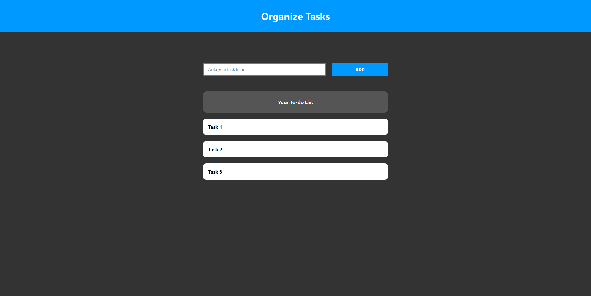

# Organize Task

Primeiro vou organizar como o projeto será desenvolvido, listando em mini tarefas.

Versão 1.0

- [x] 10 minutos para definir as tarefas (7 minutos)
- [x] 20 minutos para o layout (23 minutos)
- [x] 20 minutos para o backend (25 minutos)

- [x] Organizar as tarefas
- [x] Frontend
    - [x] Organizar arquivos do projeto
    - [x] Instalar biblioteca Sass
    - [x] Header
        - [x] Com nome Organize Tasks
        - [x] Cor azul
    - [x] Input
        - [x] Para receber texto
        - [x] Centralizado
    - [x] Button
        - [x] Criar tarefa
        - [x] Centralizado
        - [x] Cor azul, igual o Header
    - [x] Mostrar todas as tarefas
        - [x] Centralizado
- [x] Backend
    - [x] Criar um array de tarefas
    - [x] Receber a nova tarefa
    - [x] Adicionar nova tarefa no array

Visto que a primeira versão foi desenvolvida como o esperado. Partiu para a versão 2.0.

